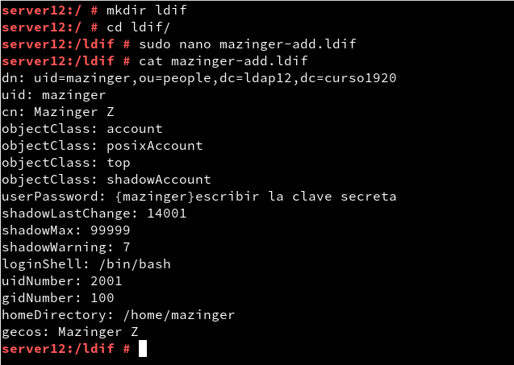

# Servidor 389-DS - OpenSUSE
##  Comprobación Rubrica.

* **(2.3) Comprobar el contenido del DS LDAP.**

Comprobación del contenido directamente.
  

Comprobación del contenido usando calve y contraseña.

* **(3.2) Comprobar nuevos usuarios**

Creamos el fichero ldif que contiene la información para la creación del nuevo usuario.

y luego con el fichero creado añadimos al usuario.

Comprobación de creación del usuario.

* **(4.3) Comprobar los usuarios creados.**

Tras crear varios usuario vamos a una maquina cliente e intentamos acceder para ver si los usuario esta creados correctamente.

