# Servidor de impresión en Windows.
##  Comprobación Rubrica.

* (1.3) Comprobar que se imprime de forma local.

Primero creamos el documento y seleccionamos imprimir.

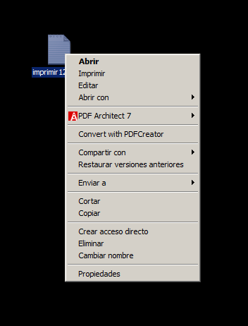

Entremos en el PDFCreator.

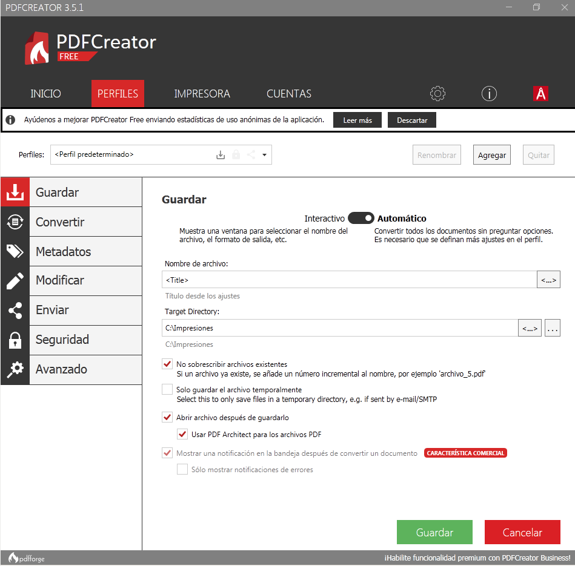

Comprobamos que nos lo muestra.

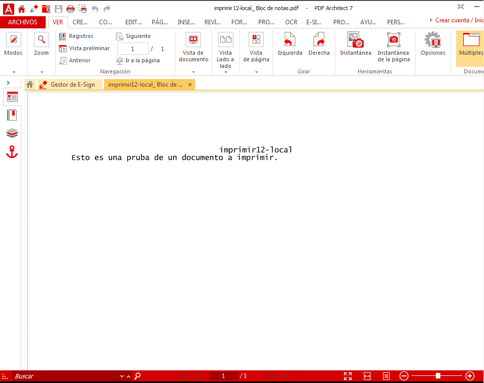

Vemos que se a guardado en la ruta por defecto.

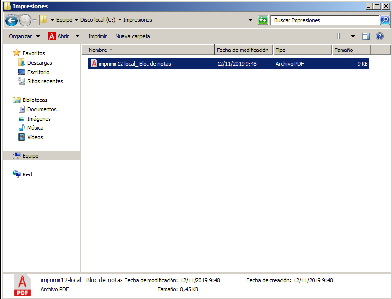

* (2.2) Comprobar que se imprime de forma remota.

Primero buscamos el recurso de red del servidor.

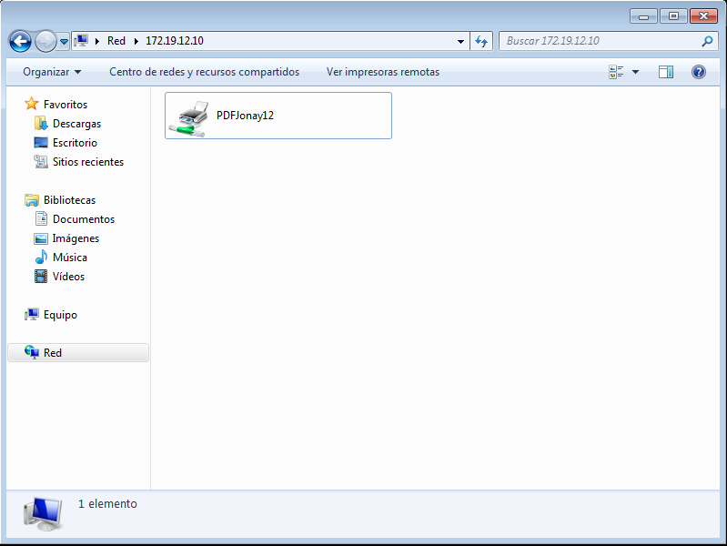

Botón derecho, conectar y ponemos el usuario/clave del Windwos Server.

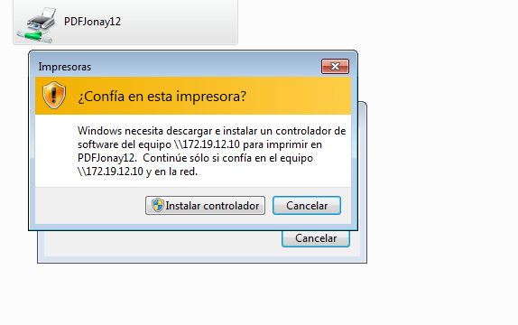

Creamos el documento y le damos a imprimir.

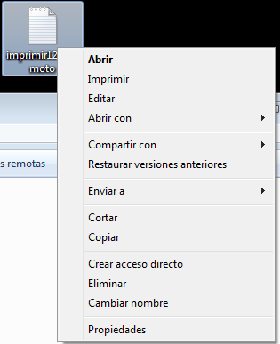

Vemos que se ha añadido a cola y luego se va a imprimir.

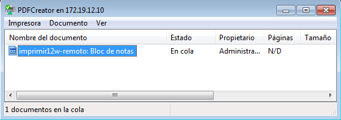

Vamos a ver si se a guardado en la carpeta por defecto.

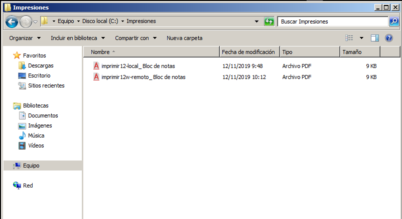

* (3.3) Comprobar que se imprime desde el navegador.

Primero vamos a poner en pausa los trabajos de impresión de la impresora.

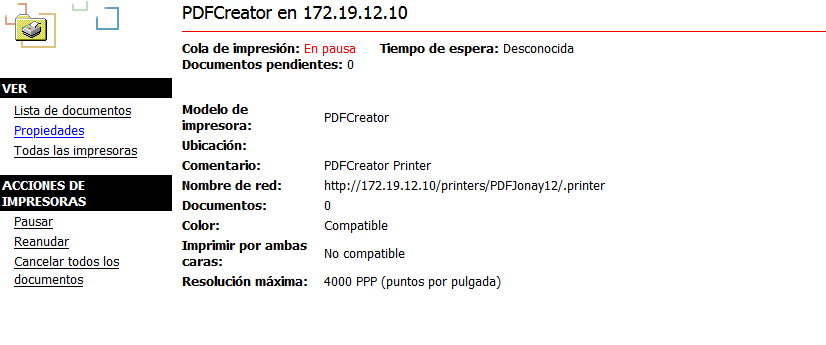

Vamos al cliente y añadimos el nuevo documento a imprimir. Vemos que se mantiene en cola pero no se imprime.

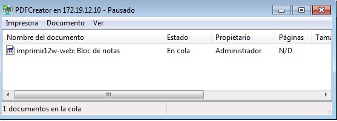

Con esto vamos de nuevo al navegador y quitamos la pausa de impresión.

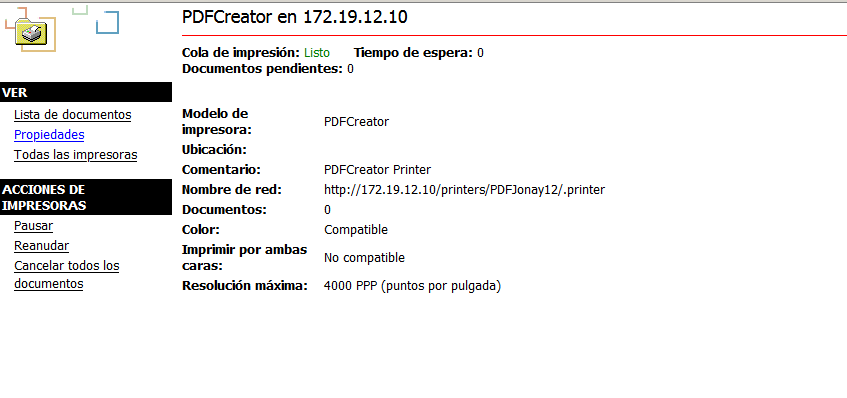

Volvemos al cliente y vemos que comienza la impresión del documento.

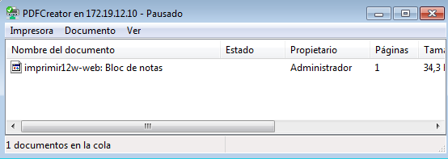

Comprobamos que se impreso en la carpeta.

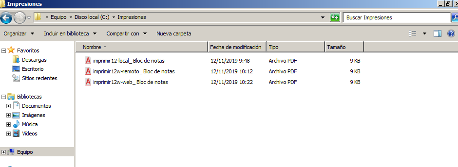
