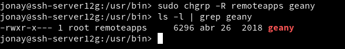

# Acceso Remoto SSH
##  Comprobación Rubrica.

* (2.2) Primera conexión SSH GNU/Linux.

nmap -Pn ssh-serverXXg, comprobar los puertos abiertos en el servidor (SSH debe estar open). Debe mostrarnos que el puerto 22 está abierto. Debe aparecer una línea como "22/tcp open ssh".

Desde el cliente GNU/Linux nos conectamos mediante ssh 1er-apellido-alumno1@ssh-serverXXg. Capturar imagen del intercambio de claves que se produce en el primer proceso de conexión SSH.

Si nos volvemos aconectar ya no nos mostrara el intercambio de claves.

Comprobar contenido del fichero $HOME/.ssh/known_hosts en el equipo ssh-client1

Comprobamos CON Vdir.

* (3.2) Comprobar cambio clave servidor SSH.

En windows.

En OpenSUSE.

* (5) Autenticación mediante clave pública.

ssh-keygen -t rsa para generar un nuevo par de claves para el usuario en

Ahora vamos a copiar la clave pública (id_rsa.pub), al fichero "authorized_keys" del usuario remoto 1er-apellido-alumno4 que está definido en el servidor.

Comprobación.

* (6) Uso de SSH como túnel para X

En este caso instalamos geany.

Modificar servidor SSH para permitir la ejecución de aplicaciones gráficas, desde los clientes. Consultar fichero de configuración /etc/ssh/sshd_config (Opción X11Forwarding yes)

En el cliente, zypper se APP1, comprobar que no está instalado el programa APP1.

ssh -X primer-apellido-alumno1@ssh-serverXXg, nos conectamos de forma remota al servidor, y ahora ejecutamos APP1 de forma remota.

Iniciamos la aplicación.

* (8.1) Restricción sobre un usuario

Crear grupo remoteapps.

Cambiar permisos geany.

Cambiar grupo geany.

Iniciamos con usuario que no esta en el grupo.

Iniciamos con usuario que si esta en el grupo.

