# Salt-stack

### 1. Master: Instalar y configurar.
#### 1.1 Configurar hosts.
Configurar /etc/hosts con "IP nombre" de MV1 y MV2.

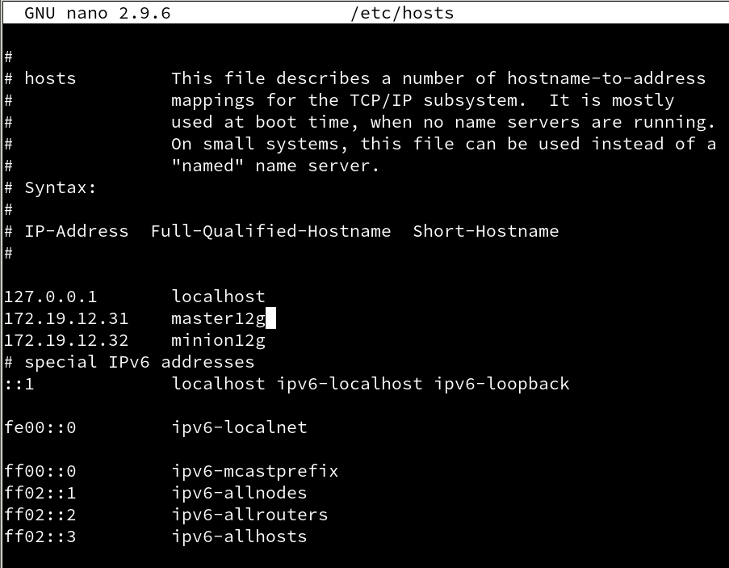

#### 1.2. Instalacion y configuración.
Ir a la MV1, zypper install salt-master, instalar el software del Máster.
Modificar /etc/salt/master para configurar nuestro Máster.

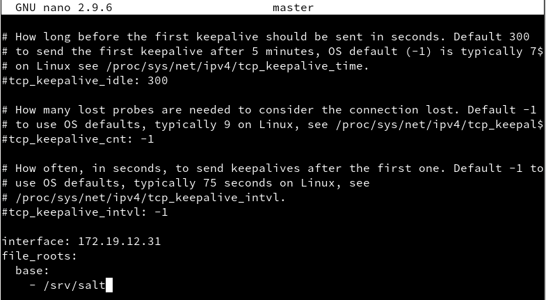

Reiniciamos el servicio y lo habilitamos para que se mantenga cuando la maquina se reinicie.
Luego hacemos **salt-key -L** para consultar los minion aceptados.

 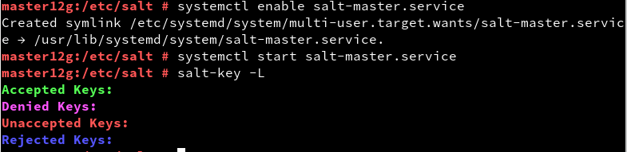

### 2. Minio: Instalar y configurar
#### 2.1 Instalación y configuración.

Instalamos **salt-minio** con **zypper** y modificamos el fichero /etc/salt/minion para definir quien será nuestro Master.

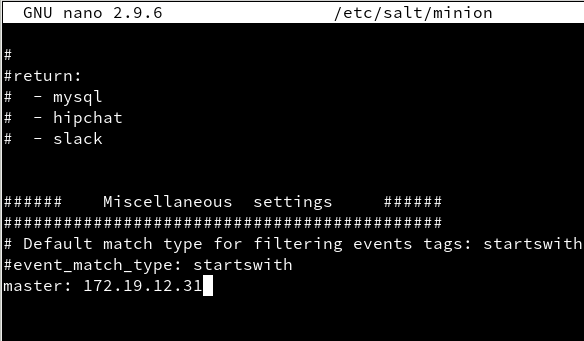

Comprobar que que no tenemos instalado apache2 en el Minion.

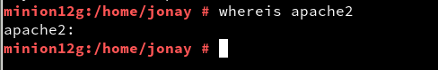

#### 2.2 Comprobación minion
Ahora vamos a ir al master para comprobar que el minio aparece en la lista de keys y lo podemos registrar.

salt-key -L, vemos que el Máster recibe petición del Minion.

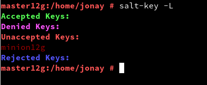

salt-key -a minionXXg, para que el Máster acepte a dicho Minion. Y volvemos a comprobar.

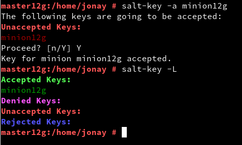

#### 2.3 Comprobación conectividad.
Comprobamos la conectividad desde el Máster a los Minions.

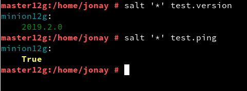

### 3. Salt States
#### 3.1 Crear directorios.
Creamos el directorio **base** y **devel**.
Y el fichero **roots.conf** en **master.d**, luego reiniciamos el servicio.

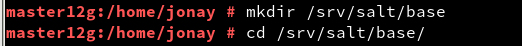

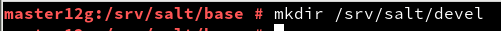

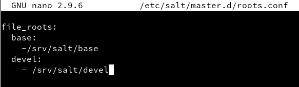

#### 3.2 Crear estado.
Creamos el directorio **apache** y dentro el fichero **init.sls**.

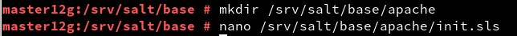

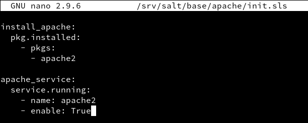

#### 3.2 Asociar estado a Minions.
En el master crear /srv/salt/base/top.sls, donde asociamos a todos los Minions con el estado que acabamos de definir.

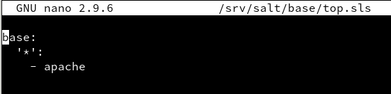

#### 3.2 Comprobar estados.

Consultamos el estado definidos para cada minion.

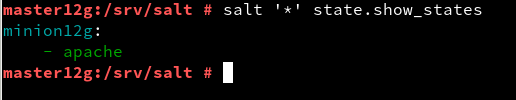

#### 3.3 Aplicar el nuevo estado.

Consultamos los estado en detalle y nos aseguramos que no hay errores.

`salt '*' state.show_lowstate`

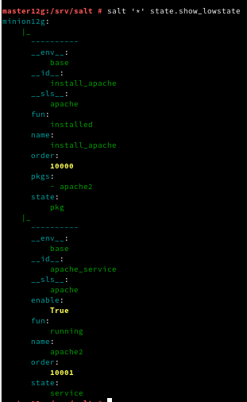

`salt '*' state.show_highstate`

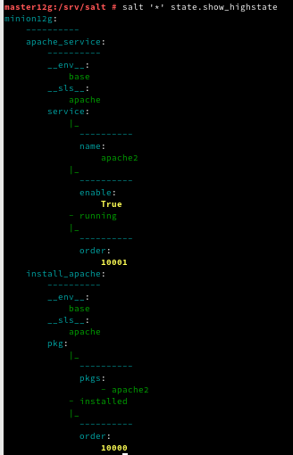

Aplicamos el nuevo estado para todos los minions.

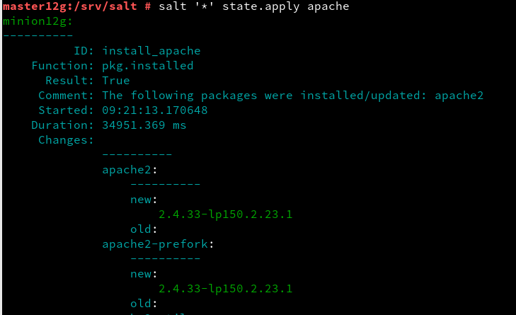

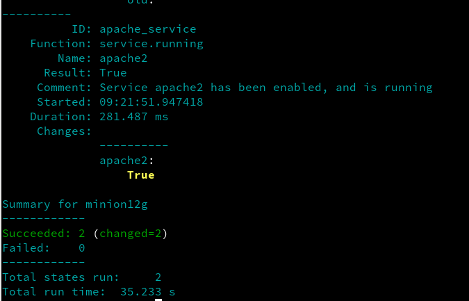

### 4. Crear más estados.
#### 4.1 Estado "users"
Crear directorio **/srv/salt/base/users**, crear fichero **/srv/salt/base/users/init.sls** con los usuario **koji12** y **drinfierno12** en el grupo **mazingerz**.

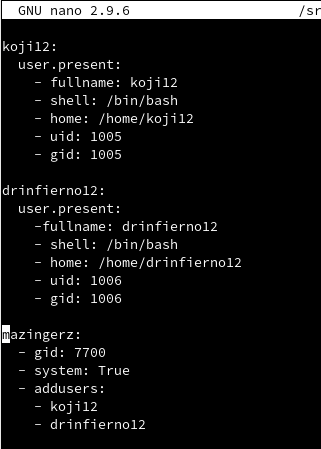

#### 4.2 Estado "directories"
Crear estado drectories para crear las carpetas private, public y group en el home del usuario koji.

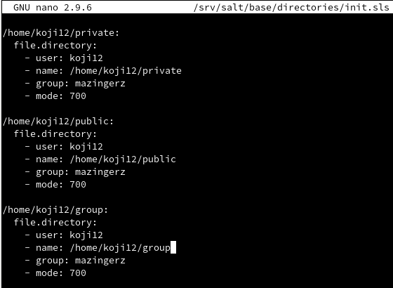

### 5. Añadir minion de otro SO.
Crear MV3 con SO Windows (minion12w)
Instalar salt-minion en MV3.
Ir a MV1(Máster) y aceptar al minion.

Añadimos en etc hosts la ip y el nombre del master y en el master el del minion.

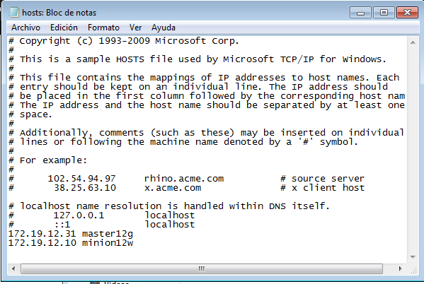

Comprbamos en el master con **salt-key -L** que nos aparece el nuevo minion de windows.

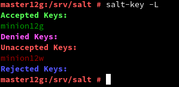

Y lo añadimos como hicimos antes.

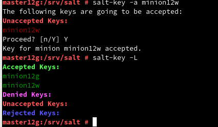
