# Vagrant con VirtualBox
##  Comprobación Rubrica.

### (3.3) Comprbar proyecto 1

Dentro de la carpeta del proyecto abrimos un terminal y lanzamos la maquina con **vagrant up**.
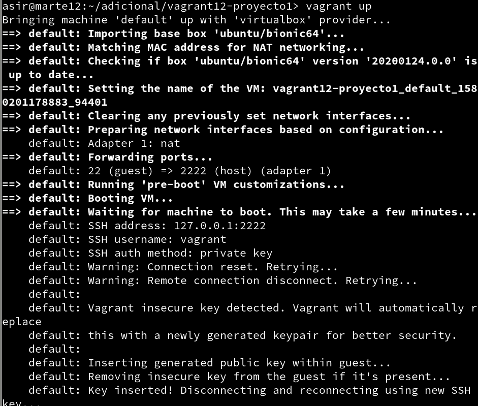

Luego de que la máquina arranque usamos **vagrant ssh**.
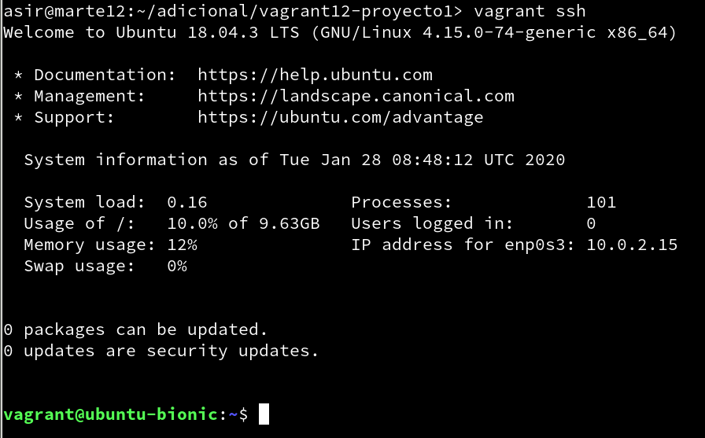

### (5.2) Comprobar proyecto 2

Comprobaremos que el puerto 4567 está a la escucha con **Vagrant port**.
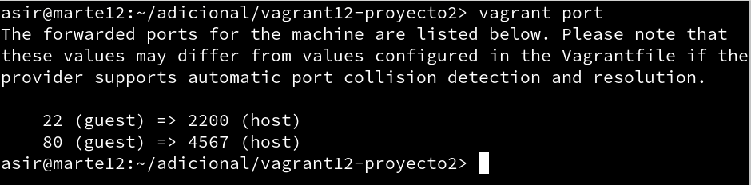

Abrimos el navegador web y pondemos la  url **http://127.0.0.1:4567**.
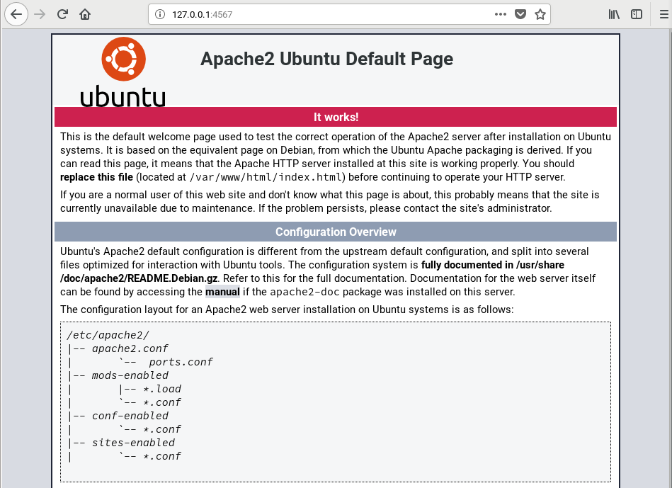

### (6.1) Suministro Shell Script
Crear directorio, entramos, creamos fichero html/index.html
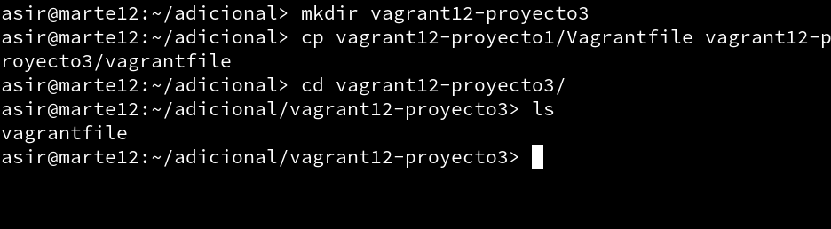

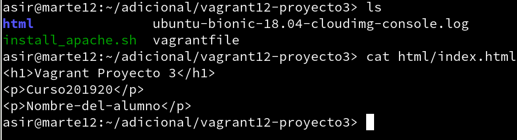

Crear el scrip y darles permisos de ejecución.
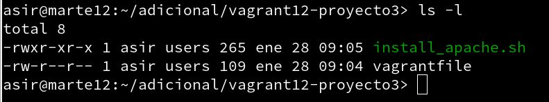

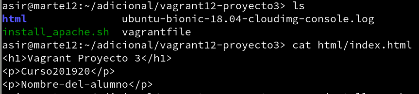

Crear el ficehro vagrantfile.
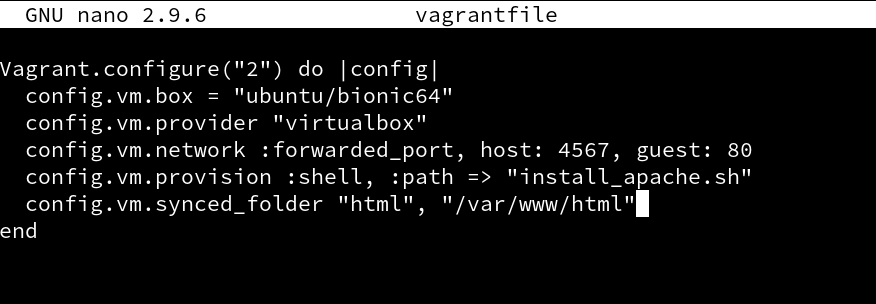

Lanzamos la maquina.
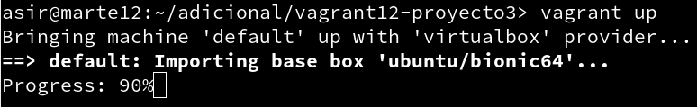

Y comprobamos accediendo a la url para ver si se ha instalado el apache.

### (6.2) Suministro Puppet
Creamos la carpeta del directorio, vagrantfile y el fichero install_puppet.sh

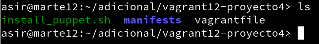

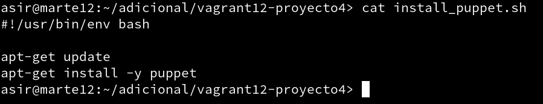

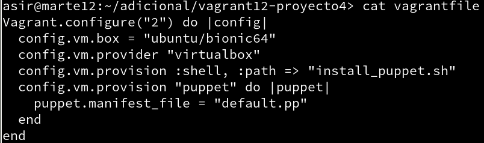

Creamos un fichero manifests y dentro un archivo default.pp con las siguientes lineas.
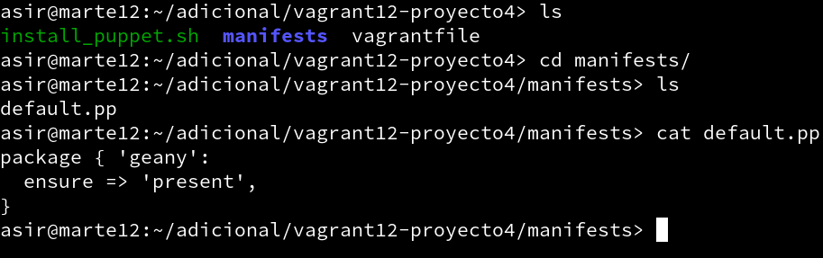

Con esto lanzamos la maquina.
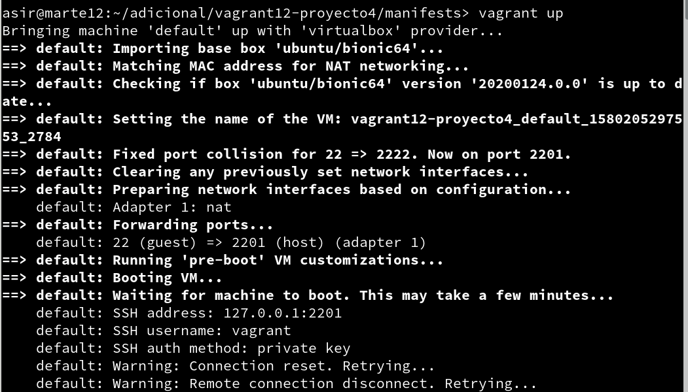

Y lanzamos vagrant provision instalar el programa usando puppet.
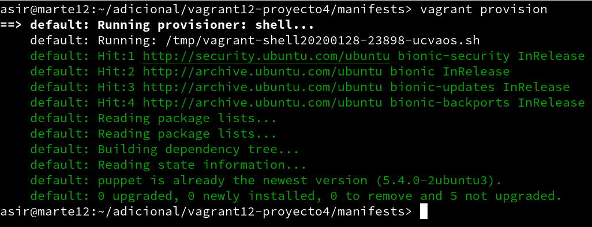

### (7.2) Crear Box Vagrant
Priemro creamos la carpeta para trabajar y entramos en ella.
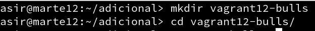

Con **VBoxManage list vms** vemos las maquinas virtuales que tenemos, seleccionamos la que vamos a convertir en una caja de vagrant y copiamos el nombre.
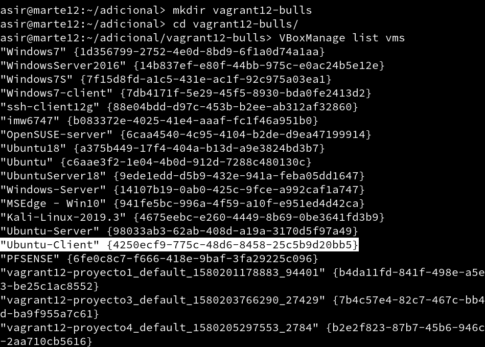

Lanzamos el siguiente comando que nos creara el package.box de la maquina vidtual.
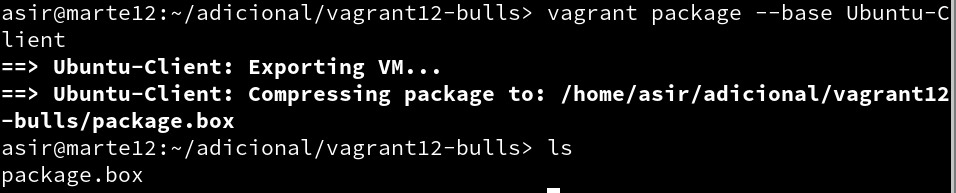

Ahora lanzamos **vagrant box list** para ver las cajas que tenemos y veremos que no esta la nuestra porque debemos añadirla, para ello usamos **vagrant box add micaja12-ubuntu.client package.box**
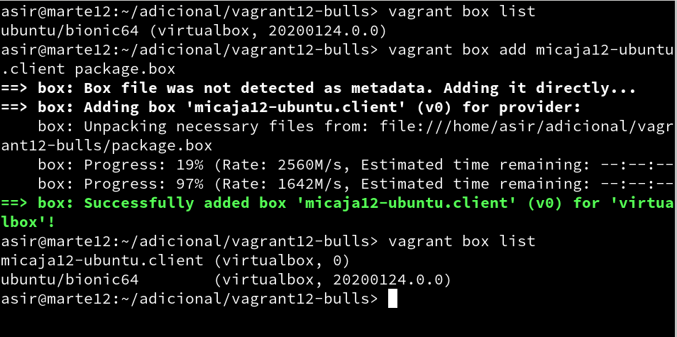

