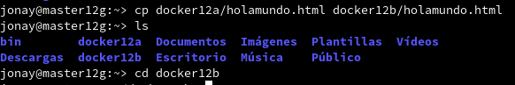

# Docker

### 1. Instalación y configuración..
#### 1.1 Habilitar el acceso a la red externa.
Para que nuestro docker tenga acceso a la red exterior, debemos activar la opción IP_FOWARD en el yast o en su fichero de configuracion **/proc/sys/net/ipv4/ip_forward**

#### 1.2. Instalación.
Ir a la MV1, instalamos docjer e iniciamos el servicio.

Con **docker version** podemos comprobar que muestra la informacón de la version client y servidor.

 

#### 1.3. Primera prueba.

Primero con **docker images** muestra las imágenes descargadas hasta ahora.

Descargamos una imagen "Hello-word", creamos el contenedor y ejecuta la aplicación.

Si conprobamos las imagenes, vemos que tenenmos la que acabamos de crear.

### 2. Creacion de imagen.
#### 2.1 Crear contenedor.

Buscamos "debian" en el repositorio de Docker Hub.

Lo descargamos en local.

Comprbamos que la tenemos descargada.

Luego con **docker run** creamos el contenedor.

#### 2.2 Personalizar contenedor.
Instalamos algunas aplicaciones.

Instalamos nginx.

Instalamos vim.

Vamos a crear un fichero html en nginx.

Ahora vamos a crear un script que nos permitira tener siempre en ejecución el nginx.

#### 2.3 Crear una imagen a partir del contenedor.
Con **docker commit con_debian nombre-del-alumno/nginx1**, a partir del CONTAINERID vamos a crear la nueva imagen que se llamará "nombre-del-alumno/nginx1".

### 3. Crear contenedor a partir de nuestra imagen.
#### 3.1 Crear contenedor.
**docker run --name=con_nginx1 -p 80 -t dvarrui/nginx1 /root/server.sh**, iniciar el contenedor a partir de la imagen anterior

#### 3.2 Comprobación.
Primero usamos **docker ps**, donde veremos que la última columna nos indica que el puerto 80 del contenedor está redireccionando a un puerto local.
Con ese puerto nos vamos a una navegador y accedemos 0.0.0.0:PORT

Tanbien podemos ver el fichero html que creamos anteriormente, especificandoselo en la url.

#### 3.3 Exportar imagen.
Tambien podemos exportar la imagen para generar el contenedor en cualquier otro sistema.Para ello usamos el siguiete comando.

### 4. Dockerfile.
#### 4.1 Preparar fichero.
Vamos a hacer lo mismo que hemos echo antes pero usando un fichero **dockerfile**.
- Crear directorio /home/nombre-alumno/dockerXXa.
- Entrar el directorio anterior.
- Poner copia del fichero holamundo.html anterior.
* Poner copia del fichero server.sh anterior.
* Crear el fichero Dockerfile.

#### 4.2 Crear imagen con Dockerfile.
Estando dentro de la carpeta que creamos anteriormente, usamos el siguiente comando que nos construye una nueva imagen a partir del dockerfile.

#### 4.3 Crear contenedor y comprobar.
Creamos en contenedor a partir de la imagen.

Ahora comprobamos, al igual que antes añadiendo el puerto.

#### 4.4 Usar imagen ya creada.
El ejemplo anterior donde creábamos una imagen docker con nginx se puede simplificar aún más aprovechando imágenes que ya existen.

* Crea el directorio dockerXXb. Entrar al directorio.
* Crea el siguiente Dockerfile

* Añadimos el html para que no haya problemas para que encuentre el fichero.

* docker build -t nombre-alumno/nginx3, crear la imagen

* Crear el contenedor.

### 5. Limpiar contenedor e imágenes.

Cuando terminamos con los contenedores, y ya no lo necesitamos, es buena idea pararlos y/o destruirlos.

- docker ps -a
- docker stop ...
- docker rm ... Lo mismo con las imágenes:
- docker images
- docker rmi ...

